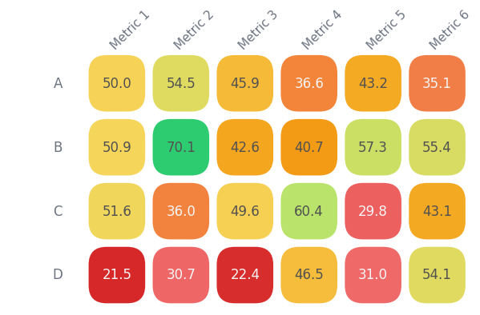

# Heatmap

Small, no-deps helper for drawing rounded-cell heatmaps with Matplotlib.

## Background

This small script came out of a real need during a case study presentation. I wanted a heatmap that looked good enough for slides without spending time adjusting Matplotlib settings every time. Packaging it into a function made it easy to reuse across projects and keep a consistent style.

## Install

```bash
pip install matplotlib numpy pandas
```

## Use

```bash
import pandas as pd
from heatmap import rounded_heatmap

# Load example CSV with first column as index
df = pd.read_csv("data/example.csv", index_col=0)

fig, ax = rounded_heatmap(
    df.values,
    row_labels=df.index.tolist(),
    col_labels=df.columns.tolist()
)

fig.savefig("images/heatmap.png", bbox_inches="tight")
```

## Output



## Parameters

- **data** – 2D NumPy array or pandas DataFrame `.values` containing numeric data.
- **row_labels / col_labels** – Optional lists of strings for row and column headers.
- **palette_hex** – Tuple of hex color codes for the heatmap gradient.
- **reverse_palette** – If `True`, reverses the order of the palette.
- **vmin / vmax** – Manually set minimum/maximum for the color scale.
- **cell_size** – Size of each heatmap cell (affects figure size).
- **corner** – Roundness of cell corners (0–0.5).
- **gap** – Space between cells.
- **show_legend** – Display a horizontal gradient legend.
- **legend_labels** – Text labels under the legend gradient.
- **legend_bbox** – Position and size of the legend axes `(x, y, width, height)` in figure coordinates.
- **legend_radius** – Rounding size for the legend gradient box.
- **figsize** – Tuple `(width, height)` for the figure size.
- **row_label_rotation / col_label_rotation** – Rotate labels for readability.
- **col_label_xshift / col_label_yshift** – Shift column labels along X or Y axis.
- **show_values** – Overlay numeric values inside each cell.
- **value_fmt** – Format for cell values (e.g., `{:.1f}`).
- **value_fontsize** – Font size for cell values.
- **text_color_dark / text_color_light** – Override text colors for dark/light cells.
